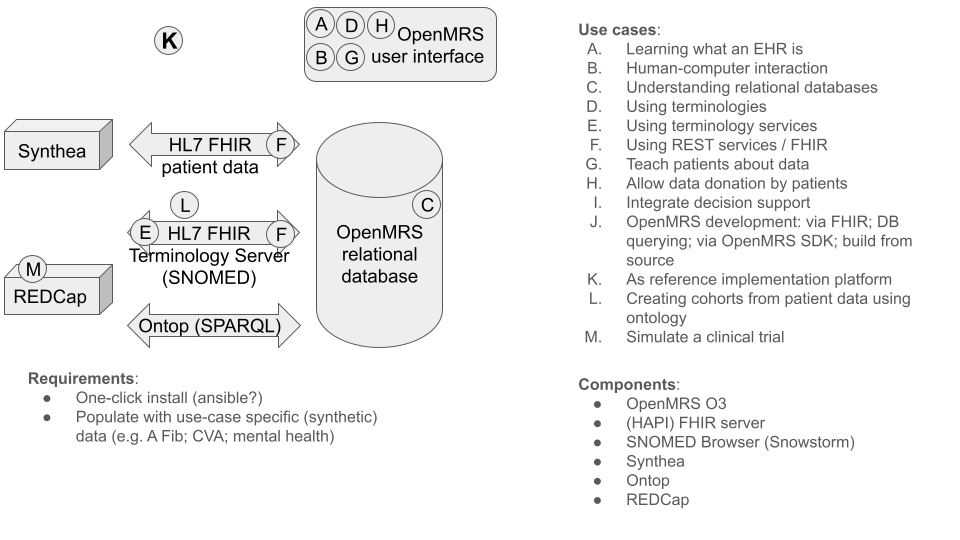

# Introduction

Electronic health records (EHRs) have become the central piece of software in modern health care. [Shen2025] Most patient care is documented and managed in the EHR, and consequently, it has long been understood that functionality to support clinical decisions should also be integrated into the EHR. [Kawamoto2005] However, shareability of clinical decision support systems (CDSSs) is a longstanding challenge, partly due to limited interoperability of EHRs. [Sittig2007, Shen2025] This makes it difficult for researchers to show how a CDSS - especially a novel CDSS - could be integrated into an EHR. Innovations in CDSSs can be disseminiated by publishing a specification, but a reference implementation for the CDSS would help potential users imagine how the CDSS could be integrated into their workflow and support them in practice, and help technical implementers understand what is required to fully implement the specification as an EHR-integrated CDSS. 

Open-source EHRs offer a unique opportunity for CDSS researchers to create a reference implementation that demonstrates their vision on how their CDSS can be integrated with an EHR and the clinial workflow. The open-source licensing model gives users the freedom to adapt the software to their needs, [gnu.org] from simply using or adding functionality that implements existing interoperability standards, to adding new functionality that demonstrates novel means of deeply integrating new kinds of support.

Additionally, open-source EHRs offer unique opportunities for educating medical informatics professionals. EHRs are central to modern health care, but many medical informatics students never get hands-on experience with an EHR until after graduation. The open-source licensing model also gives users the "freedom to inspect," [gnu.org] meaning that students can "look under the hood" of an EHR, as well as gain hands-on experience with various secondary uses of the EHR, including uses which require interoperability.

Due to the authors' previous experience with OpenMRS, [Medlock2022] OpenMRS was chosen as the target system for our Biohackathon table. The broad goal for the OpenMRS table was: What steps are needed to use OpenMRS as a resource for reference implementations?

This can be divided into 4 levels:

1. Use OpenMRS as a data source, using its available APIs
A copy of the reference implementation for OpenMRS [OpenMRS] was created, with demo data, and provided for use during the BioHackathon. The goal for this level is simply to see if a demo application for any desired functionality can be implemented simply by using the APIs that are already preset in the OpenMRS reference implementation. (Note: The OpenMRS reference implementation should not be confused with a reference implentation for new CDSS functionality. The OpenMRS reference implementation shows how OpenMRS can be implemented; our goal is to implement a reference implementation for novel CDSS functinality _integrated with_ OpenMRS.)

2. Use OpenMRS running locally, and directly access its database
The OpenMRS community provides instructions for installing OpenMRS on a local computer. [OpenMRS2] The goal for this level is to follow the provided instructions, create more detailed instructions if needed, and then build a demo application that queries the OpenMRS database. This can be used for applications that need to use the data from an EHR, but do not need to interact with users via the EHR interface.

3. Add a module to OpenMRS
This is the first step toward making modifications to OpenMRS itself. The OpenMRS community provides some "instructions for developers". [OpenMRS3] The goal for this level is to follow those instructions (and improve them where needed) with the goal of adding a simple module (e.g. "add a clickable URL to the patient summary screen"). This is what is needed to embed new functionality in OpenMRS.

4. Build OpenMRS from source
To make deep changes to OpenMRS, rather than just adding something to it, new functionality may need to be added to existing OpenMRS modules. The goal of this level is to produce instructions for building a minimum viable installation of OpenMRS from source.

An additional goal of this table is to produce a "roadmap" for EHR education, describing what medical informatics students should learn about an EHR and how an open source EHR could be leveraged to teach it.

## Objective



## Sources:
- Shen Y, Yu J, Zhou J, Hu G. Twenty-Five Years of Evolution and Hurdles in Electronic Health Records and Interoperability in Medical Research: Comprehensive Review. J Med Internet Res. 2025 Jan 9;27:e59024. doi: 10.2196/59024.
- Kawamoto K, Houlihan CA, Balas EA, Lobach DF. Improving clinical practice using clinical decision support systems: a systematic review of trials to identify features critical to success. BMJ. 2005 Apr 2;330(7494):765. doi: 10.1136/bmj.38398.500764.8F.
- Sittig DF, Wright A, Osheroff JA, Middleton B, Teich JM, Ash JS, Campbell E, Bates DW. Grand challenges in clinical decision support. J Biomed Inform. 2008 Apr;41(2):387-92. doi: 10.1016/j.jbi.2007.09.003. 
- https://www.gnu.org/philosophy/free-sw.en.html accessed 2026-04-09
- Medlock S, Ploegmakers KJ, Cornet R, Pang KW. Use of an open-source electronic health record to establish a "virtual hospital": A tale of two curricula. Int J Med Inform. 2023 Jan;169:104907. doi: 10.1016/j.ijmedinf.2022.104907.
- https://github.com/openmrs/openmrs-distro-referenceapplication accessed 2026-04-09
- https://openmrs.atlassian.net/wiki/spaces/docs/pages/150930190/Set+Up+an+Instance+of+O3  accessed 2026-04-09
- https://openmrs.atlassian.net/wiki/spaces/docs/pages/25477022/Getting+Started+as+a+Developer accessed 2026-04-09
- Level 3 (OpenMRS development): https://gitlab.com/openmrs_education/openmrs-sdk-sandbox
- Level 4 (OpenMRS from source): https://gitlab.com/ericherman/openmrs-sandbox

## Install reference implementation
```
gh repo clone openmrs/openmrs-distro-referenceapplication
cd openmrs-distro-referenceapplication
docker compose up (or docker compose up -d)
```
Waited — saw empty screen / 504s for ~30 min (first-time data load)
```
docker compose restart backend (when stuck)
```
Waited ~17 min for backend to finish loading
Accessed http://localhost/openmrs/spa, logged in with admin / Admin123

### Initial screen after succesful reference implementation


### Contributor Role Taxonomy

A last feature since is minimal support for the Contributor Role Taxonomy (CRediT). You
can specify the role of authors in writing the report with the `role:` field. However,
the authors are responsible for selection the right terms from [CRediT](https://credit.niso.org/).
An example looks like this:

```yaml
authors:
  - name: First Author
    affiliation: 1
    orcid: 0000-0000-0000-0000
    role: Conceptualization, Writing – review & editing
```


### A full examples

A full example then has this structure:

```yaml
authors:
  - name: First Author
    affiliation: 1
    role: Writing – original draft
  - name: Last Author
    orcid: 0000-0000-0000-0000
    affiliation: 2
    role: Conceptualization, Writing – review & editing
affiliations:
  - name: First Affiliation
    index: 1
  - name: ELIXIR Europe
    ror: 044rwnt51
    index: 2
```

# Formatting

This document use Markdown and you can look at [this tutorial](https://www.markdowntutorial.com/).

## Subsection level 2

Please keep sections to a maximum of only two levels.

## Tables

Tables can be added in the following way, though alternatives are possible:

```markdown
Table: Note that table caption is automatically numbered and should be
given before the table itself.

| Header 1 | Header 2 |
| -------- | -------- |
| item 1 | item 2 |
| item 3 | item 4 |
```

This gives:

Table: Note that table caption is automatically numbered and should be
given before the table itself.

| Header 1 | Header 2 |
| -------- | -------- |
| item 1 | item 2 |
| item 3 | item 4 |

## Figures

A figure is added with:

```markdown

```

This gives:


Figures can be scaled by adding the width or height to the Markdown like this:

```markdown
{ width=50px }
```

# Other main section on your manuscript level 1

Lists can be added with:

1. Item 1
2. Item 2

# Citation Typing Ontology annotation

You can use [CiTO](http://purl.org/spar/cito/2018-02-12) annotations, as explained in [this BioHackathon Europe 2021 write up](https://raw.githubusercontent.com/biohackrxiv/bhxiv-metadata/main/doc/elixir_biohackathon2021/paper.md) and [this CiTO Pilot](https://www.biomedcentral.com/collections/cito).
Using this template, you can cite an article and indicate _why_ you cite that article, for instance DisGeNET-RDF [@citesAsAuthority:Queralt2016].

The syntax in Markdown is as follows: a single intention annotation looks like
`[@usesMethodIn:Krewinkel2017]`; two or more intentions are separated
with colons, like `[@extends:discusses:Nielsen2017Scholia]`. When you cite two
different articles, you use this syntax: `[@citesAsDataSource:Ammar2022ETL; @citesAsDataSource:Arend2022BioHackEU22]`.

Possible CiTO typing annotation include:

* citesAsDataSource: when you point the reader to a source of data which may explain a claim
* usesDataFrom: when you reuse somehow (and elaborate on) the data in the cited entity
* usesMethodIn
* citesAsAuthority
* citesAsEvidence
* citesAsPotentialSolution
* citesAsRecommendedReading
* citesAsRelated
* citesAsSourceDocument
* citesForInformation
* confirms
* documents
* providesDataFor
* obtainsSupportFrom
* discusses
* extends
* agreesWith
* disagreesWith
* updates
* citation: generic citation


# Results


# Discussion

...

## Acknowledgements

...

## References
